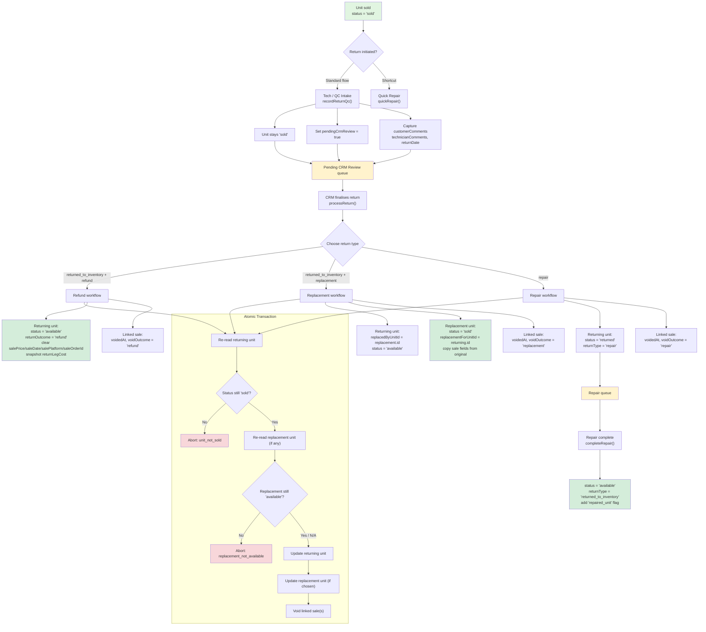

# Returns Workflow — Production-Hardened Implementation

This diagram shows the complete returns lifecycle we implemented, including the Tech-QC → CRM hand-off, atomic transaction wrapping, and role-based gating.

## Role gating

| Action | Who can do it |
|--------|---------------|
| Read returns data | Any signed-in team member |
| Update return/void fields (`status='returned'`, `returnType`, `voidOutcome`, etc.) | **Returns managers** or **admins** |
| Normal stock/sale edits that don't touch return fields | Any signed-in team member |
| Hard delete on `inventoryUnits` / `sales` | Admins only |

## Key code paths

| Function | File | Purpose |
|----------|------|---------|
| `recordReturnQc()` | `src/services/returnsService.ts` | Tech-QC intake, sends unit to CRM queue |
| `processReturn()` | `src/services/returnsService.ts` | CRM finalise: refund, replacement, or repair |
| `quickRepair()` | `src/services/returnsService.ts` | One-click send-to-repair, bypasses QC |
| `completeRepair()` | `src/services/returnsService.ts` | Mark repaired unit as available |
| `dbService.runTransaction()` | `src/lib/dbService.ts` | Atomic Firestore transaction wrapper |
| `querySalesByUnitId()` / `querySalesByImei()` | `src/lib/dbService.ts` | Targeted sale lookups |
| `isReturnsManager()` | `src/lib/firebase.ts` + `firestore.rules` | Role check |
